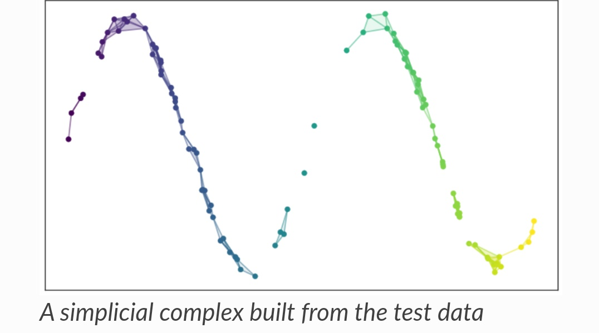
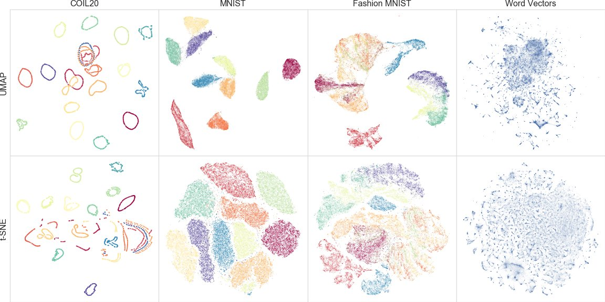
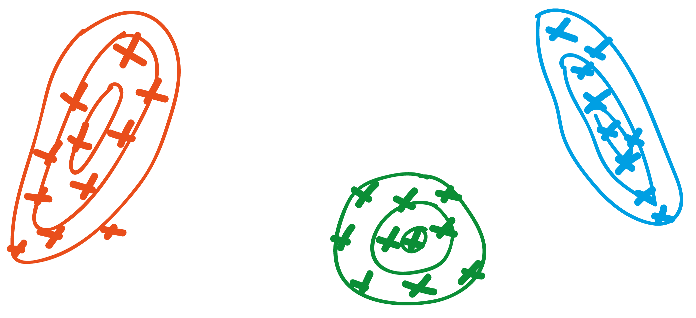

## Material covered today

- what is meant by machine learning?
- dimensionality reduction methods: PCA, t-SNE and UMAP
- clustering

# What is machine learning? (At two levels of difficulty.)

## Level 1

```{r setup, include=FALSE}
knitr::opts_chunk$set(echo = TRUE)
library(tidyverse)
library(reshape2)
```

## Varieties (ignoring reinforcement learning)

```{r, echo = FALSE, out.width = "800px",fig.align="center",warnings=FALSE}
  knitr::include_graphics("figures/ml_types-01.png")
```

## Supervised: classification

```{r, echo = FALSE, out.width = "800px",fig.align="center"}
  knitr::include_graphics("figures/supervised_1.png")
```

## Supervised: regression

```{r, echo = FALSE, out.width = "800px",fig.align="center"}
  knitr::include_graphics("figures/supervised_2.png")
```

## Unsupervised: data

```{r, echo = FALSE, out.width = "600px",fig.align="center"}
  knitr::include_graphics("figures/unsupervised_1.png")
```

## Unsupervised: example result

```{r, echo = FALSE, out.width = "600px",fig.align="center"}
  knitr::include_graphics("figures/unsupervised_2.png")
```

## Level 1: summary
Machine learning comes in two varieties:

- supervised learning:
    - typically lots of data-label pairs
    - aim is to build a model data -> label
    - categorical labels: classification
    - numeric labels: regression
- unsupervised learning:
    - unlabelled data
    - goals are vaguer but generally aims to simplify data and uncover patterns
    
## Level 2

## How does a computer "see" a cat?
```{r, echo = FALSE, out.width = "600px",fig.align="center"}
  knitr::include_graphics("figures/cat-matrix.png")
```

## How many images are possible?

- for a 20 x 20 binary image -> $X$ has dimensionality of 400
- $2^{400}\approx 2 \times 10^{120}$ possible images
- a very small proportion of those correspond to real world type images
- a very small proportion of real world images correspond to cats
- idea: even if dimensionality is big, effective dimensionality much lower
    - ML aims to find these lower dimensional representations

## Supervised learning

## Supervised learning
```{r, echo = FALSE, out.width = "600px",fig.align="center"}
  knitr::include_graphics("figures/supervised_3.png")
```

## Rule determination

- Want to learn a rule $f: X \rightarrow y$
- Rule is a mathematical function controlled by low-dimensional parameters: $f=f(\theta)$
- Have training data:

$$(X_1, y_1), (X_2, y_2), ..., (X_n, y_n)$$

Can we learn $f$ by optimising $\theta$ on training data?

## Example rules
```{r, echo = FALSE, out.width = "600px",fig.align="center"}
  knitr::include_graphics("figures/supervised_4.png")
```

## What is  $\; f$?

- Linear combination of elements of $X$ (linear regression)
- Linear combination of functions of elements of $X$ (kernel regression)
- Regression trees (random forests, boosted regression)
- Non-linear combinations of elements, stacked into multiple layers (deep learning)

## How to learn optimal parameters?
```{r, echo = FALSE, out.width = "1000px",fig.align="center"}
  knitr::include_graphics("figures/supervised_5.png")
```

## Unsupervised learning
  
## Unsupervised learning
```{r, echo = FALSE, out.width = "800px",fig.align="center"}
  knitr::include_graphics("figures/unsupervised_3.png")
```

## Unsupervised learning: what does $Z$ capture?
```{r, echo = FALSE, out.width = "800px",fig.align="center"}
  knitr::include_graphics("figures/unsupervised_4.png")
```

## Unsupervised learning: clustering
```{r, echo = FALSE, out.width = "800px",fig.align="center"}
  knitr::include_graphics("figures/unsupervised_5.png")
```

## Level 2: summary

- ML algorithms take numeric objects (vectors / matrices / tensors) as input
- intrinsic dimensionality of most things $<$ raw dimensions: world simpler
- supervised learning:
    - determines a mathematical function to predict outputs from inputs
    - function depends on parameters which must be learned using training / testing data
    - learning based on optimising cost function
    
## Level 2: summary
- unsupervised learning:
    - attempts to find more parsimonious representation of data
    - low dimensional variables learned may be more interpretable
    - clustering is an example of unsupervised ML

## Questions?

# Unsupervised learning

## Flavours of unsupervised learning

- dimensionality reduction
- clustering (really a type of dim. reduction)
- (outlier detection)

## Dimensionality reduction

## What is dimensionality reduction?

- most real life things have lots of features
- many features exhibit a degree of redundancy
- the effective number of important features is lower and we aim to identify these

## Why reduce dimensions?

- universe is complex
- science aims to understand constituent laws to simplify universe
- more parsimonious theories have greater information compression and tend to generalise better

## Why can dimensionality reduction help?

- improves interpretability
- aids visualisation
- extracts core features for supervised learning
- (lossy) information compression
- noise reduction

## Classes of dimensionality reduction

- projection
- manifold learning

## Wine data
```{r, echo = FALSE, warning=FALSE, message=FALSE}
knitr::opts_chunk$set(echo = TRUE)
library(tidyverse)
library(kableExtra)
df <- readRDS("data/winemag-data_first150k_10000.rds")%>% select(-description)
kable(df[1:100, ],format="html",escape = F, col.names = colnames(df)) %>% 
  kable_styling() %>%
  kableExtra::scroll_box(width = "100%", height = "400px")
```

# Projection

## Types

- Principal Components Analysis (PCA)
- Linear discriminant analysis
- Kernel PCA

## PCA

## Example raw data
```{r, echo = FALSE, out.width = "800px",fig.align="center"}
knitr::include_graphics("figures/pc_1.png")
```

## Modelling data

- Looks normally distributed:

\begin{equation}
(x_1,x_2)' \sim \mathcal{N}(\mu, \Sigma)
\end{equation}

where $\Sigma$ is dense.

- Can we use this assumption to move to more natural coordinate system? I.e.

\begin{equation}
(y_1,y_2)' \sim \mathcal{N}(0, D)
\end{equation}

where $D$ is diagonal.

## Example raw data
```{r, echo = FALSE, out.width = "800px",fig.align="center"}
knitr::include_graphics("figures/pc_1.png")
```

## Assumed generative model
```{r, echo = FALSE, out.width = "800px",fig.align="center"}
knitr::include_graphics("figures/pc_2.png")
```

## 1st PC component axis
```{r, echo = FALSE, out.width = "800px",fig.align="center"}
knitr::include_graphics("figures/pc_3.png")
```

## 2nd PC component axis
```{r, echo = FALSE, out.width = "800px",fig.align="center"}
knitr::include_graphics("figures/pc_4.png")
```

## How to obtain PC axes?

Remember, we've assumed:

\begin{equation}
(x_1,x_2)' \sim \mathcal{N}(\mu, \Sigma)
\end{equation}

1. Centre data:

\begin{equation}
(\tilde x_{1,i}, \tilde x_{2,i}) = (x_{1,i}, x_{2,i}) - (\bar x_{1}, \bar x_{2})
\end{equation}

2. Estimate covariance matrix:

\begin{equation}
\widehat{\Sigma} = \frac{1}{n}\sum (\tilde x_{1,i}, \tilde x_{2,i})' (\tilde x_{1,i}, \tilde x_{2,i})
\end{equation}

## How to obtain PC axes?

3. Eigendecompose:

\begin{equation}
\widehat{\Sigma} = P D P'
\end{equation}

- $P=[P_1, P_2]$ is matrix of eigenvectors of $\widehat{\Sigma}$ representing PC directions:

\begin{align}
y_1 &= P_1' . (\tilde x_1, \tilde x_2)\\
y_2 &= P_2' . (\tilde x_1, \tilde x_2)
\end{align}

- $D$ is diagonal with eigenvalues as diagonal elements
- eigenvector magnitudes indicate relative variance explained by that PC

## Apply PCA to wine data
```{r, echo = FALSE, warning=FALSE, message=FALSE}
library(kableExtra)
df <- readRDS("data/winemag-data_first150k_10000.rds") %>% 
  select(-description) %>% 
  mutate(review_id=seq_along(country))
kable(df[1:100, ],format="html",escape = F, col.names = colnames(df)) %>% 
  kable_styling() %>%
  kableExtra::scroll_box(width = "100%", height = "400px")
```

## Pick price and points
```{r, echo = FALSE, warning=FALSE, message=FALSE}
kable(df[1:100, ] %>% select(price, points),format="html",escape = F) %>% 
  kable_styling() %>%
  kableExtra::scroll_box(width = "100%", height = "400px")
```

## Plot price and points
```{r, echo = FALSE, warning=FALSE, message=FALSE}
df <- readRDS("data/winemag-data_first150k_10000.rds") %>% 
  mutate(review_id=seq_along(country))

df <- df[complete.cases(df), ] %>% 
  mutate(price=price,
         points=scale(points)[, 1])
df %>% 
  ggplot(aes(x=points, y=price)) +
  geom_jitter(colour="black") +
  xlim(-3.5, 4) +
  ylim(-20, 800)
```


## Apply PCA
```{r, echo = FALSE, warning=FALSE, message=FALSE}
df <- readRDS("data/winemag-data_first150k_10000.rds") %>% 
  mutate(review_id=seq_along(country))

df <- df[complete.cases(df), ] %>% 
  mutate(price=price,
         points=scale(points)[, 1])

x <- df %>% 
  select(price, points)
pca <- prcomp(x, center = T)

scores <- predict(pca, x)

df_temp <- df %>% cbind(scores)

f1 <- function(points) {
  v1 <- pca$rotation[, 1]
  m <- v1[1] / v1[2]
  c <- pca$center[1] - m * pca$center[2]
  return(m * points + c)
}

f2 <- function(points) {
  v1 <- pca$rotation[, 1]
  m <- v1[1] / v1[2]
  m <- -1 / m
  c <- pca$center[1] - m * pca$center[2]
  return(m * points + c)
}

df_temp %>% 
  ggplot(aes(x=points, y=price)) +
  geom_jitter(colour="black") +
  stat_function(fun=f1, colour="blue") +
  stat_function(fun=f2, colour="blue") +
  xlim(-3.5, 4) +
  ylim(-20, 800)
```

## What went wrong?

- PCA assumes data is distributed as multivariate normal
- price data very non-normal

```{r, echo = FALSE, warning=FALSE, message=FALSE, out.width = "600px",fig.align="center"}
df %>% 
  select(price, points, review_id) %>% 
  melt(id.vars="review_id") %>% 
  ggplot(aes(x=value)) +
  geom_histogram() +
  facet_wrap(~variable, scales="free")
```

## Take log transform of price
```{r, echo = FALSE, warning=FALSE, message=FALSE}
df %>% 
  select(price, points, review_id) %>% 
  mutate("log(price)" = log10(price)) %>% 
  select(-price) %>% 
  melt(id.vars="review_id") %>% 
  mutate(variable=fct_relevel(variable, "log(price)", "points")) %>% 
  ggplot(aes(x=value)) +
  geom_histogram() +
  facet_wrap(~variable, scales="free")
```

## Reapply PCA
```{r, echo = FALSE, warning=FALSE, message=FALSE}
df <- readRDS("data/winemag-data_first150k_10000.rds")
df <- df[complete.cases(df), ] %>% 
  mutate(price=log(price),
         points=scale(points)[, 1])

x <- df %>% 
  select(price, points)
pca <- prcomp(x, center = T)

scores <- predict(pca, x)

df_temp <- df %>% cbind(scores)

f1 <- function(points) {
  v1 <- pca$rotation[, 1]
  m <- v1[1] / v1[2]
  c <- pca$center[1] - m * pca$center[2]
  return(m * points + c)
}

f2 <- function(points) {
  v1 <- pca$rotation[, 1]
  m <- v1[1] / v1[2]
  m <- -1 / m
  c <- pca$center[1] - m * pca$center[2]
  return(m * points + c)
}

df_temp %>% 
  ggplot(aes(x=points, y=price)) +
  geom_point() +
  stat_function(fun=f1, colour="blue") +
  stat_function(fun=f2, colour="blue") +
  ylim(1.5, 5) +
  ylab("log(price)") +
  coord_fixed()
```

## Variance explained by each component
```{r, echo = FALSE, warning=FALSE, message=FALSE}
df <- readRDS("data/winemag-data_first150k_10000_processed.rds") %>% 
  filter(country %in% c("Italy", "France", "Germany")) %>% 
  droplevels()
x <- df %>% 
  select(price, points, contains("desc_"))
pca <- prcomp(x, scale. = T)

# Variation explained by different pcs
scores <- predict(pca, x)
pov <- pca$sdev^2/sum(pca$sdev^2)
pcs <- 1:9
tibble(variable=colnames(scores)[pcs],
       variance=pov[pcs]) %>% 
  ggplot(aes(x=variable, y=variance)) +
  geom_col() +
  scale_y_continuous(labels=scales::percent)
```

## What do PCs mean?
```{r, echo = FALSE, warning=FALSE, message=FALSE}
loadings <- pca$rotation %>% 
  as.data.frame() %>% 
  rownames_to_column()

loadings %>% 
  select(PC1, PC2, rowname) %>% 
  melt(id.vars="rowname") %>% 
  ggplot(aes(x=rowname, y=value)) +
  geom_col() +
  coord_flip() +
  facet_wrap(~variable)
```


## Project data onto first two PCs
```{r, echo = FALSE, warning=FALSE, message=FALSE}
df_temp <- df %>% cbind(scores)

df_temp %>% 
  ggplot(aes(x=PC1, y=PC2, colour=country)) +
  geom_point() +
  theme(legend.text = element_text(size=16),
        legend.title = element_text(size=16))
```

## Sparse PCA

- PCA components typically load on all variables: tricky to assign meaning to them
- Sparse PCA methods penalise either the count or magnitude of non-zero loadings on the independent variables $\implies$ can lead to more interpretable components

## Plot sparse loadings
```{r, echo = FALSE, warning=FALSE, message=FALSE}
# test sparse pca
fit <- sparsepca::spca(x, verbose=F)
loadings <- fit$loadings %>% 
  as.data.frame() %>% 
  mutate(rowname=loadings$rowname)

loadings %>%
  select(V1, V2, V3, rowname) %>%
  melt(id.vars="rowname") %>%
  ggplot(aes(x=rowname, y=value)) +
  geom_col() +
  coord_flip() +
  facet_wrap(~variable)
# scores1 <- fit$scores
# 
# df_temp <- df %>% cbind(scores1 %>% as.data.frame())
# 
# df_temp %>%
#   ggplot(aes(x=V1, y=price, colour=country)) +
#   geom_point()
# 
# df_temp %>%
#   ggplot(aes(x=V2, y=points, colour=country)) +
#   geom_point()
# 
# df_temp %>%
#   ggplot(aes(x=V2, y=price, colour=country)) +
#   geom_point()
# 
# df_temp %>%
#   ggplot(aes(x=V1, y=V2, colour=country)) +
#   geom_point()
```


## PCA: summary

- PCA is a projection method using linear transformations: collectively those linear transformations represent a rotation of coordinate axes
- PCA assumes data are multivariate normal
    - if not a good approximation, components can be poor representation
- works ok for simple data; less well for non-linear features

## Questions?

# Manifold learning

## What is it?

Essentially these methods try to learn the structure of the local manifolds in the data. (Also referred to as graph-based or embedding methods.)

- t-distributed stochastic nearest neighbour embedding (t-SNE)
- uniform manifold approximation and projection (UMAP)

# t-distributed stochastic nearest neighbour embedding

## High level detail

- original data in "data space" of dimensions $\mathbb{R}^k$, where $k$ is quite large
- t-SNE transforms data non-linearly to a "map space" of dimensions $\mathbb{R}^2$ or $\mathbb{R}^3$ typically
- constructs the mapping such that points close in "data space" are also close in "map space"

## Mapping tries to preserves local neighbours
```{r, echo = FALSE, out.width = "1000px",fig.align="center"}
  knitr::include_graphics("figures/t-sne_map_vs_data.png")
```

## Similarity in data space: fuzzy neighbours

- imagine a Gaussian density around each point and define a conditional similarity:

\begin{equation}
p_{j|i} = \frac{\exp(-|x_i-x_j|^2/2\sigma_i^2)}{\sum_{k\neq i} \exp(-|x_i-x_k|^2/2\sigma_i^2)}
\end{equation}

where $\sigma_i$ is different for each point: points in dense areas given smaller variance than those in sparse areas

- $p_{j|i}$ measures the probability that $x_i$ would pick $x_j$ as its neighbour

## Symmetrised similarity

Need a distance metric, so define:

\begin{equation}
p_{ij} = \frac{1}{N} (p_{j|i} + p_{i|j})
\end{equation}

yielding a similarity matrix with elements $p_{ij}$

## Similarity in map space

Uses Student-t distribution with one degree of freedom (the Cauchy):

\begin{equation}
q_{ij} = \frac{1/(1+|z_i-z_j|^2)}{\sum_{k\neq i} 1/(1+|z_i-z_k|^2)}
\end{equation}

## How to choose $z_i$?

```{r, echo = FALSE, out.width = "800px",fig.align="center"}
  knitr::include_graphics("figures/t-sne_similarity.png")
```

## Algorithm to choose $z_i$

We can calculate the Kullback-Leibler divergence (not a distance!) from $p_{ij}\rightarrow q_{ij}$:

\begin{equation}
\text{KL} = \sum_{i,j} p_{ij} \log \frac{p_{ij}}{q_{ij}}
\end{equation}

Minimise via gradient descent using $\frac{\partial \text{KL}}{\partial z_i}$

## Picking $\sigma_i$

- more uncertainty (i.e. entropy) if $\sigma_i\uparrow$
- user specifies a "perplexity" hyperparameter which effectively determines number of nearest neighbours
- t-SNE chooses $\sigma_i$ to meet this perplexity for each data point

## Applying t-SNE to wine data

## Perplexity=1
```{r, echo = FALSE, warning=FALSE, message=FALSE}
df <- readRDS("data/winemag-data_first150k_10000_processed.rds") %>%
  filter(country %in% c("Italy", "France", "Germany")) %>%
  droplevels()
x <- df %>%
  select(price, points, contains("desc_")) %>%
  unique()
df <- df[as.numeric(row.names(x)), ]
# library(Rtsne)
# tsne <- Rtsne(x, dims=2, perplexity=1, verbose=FALSE, max_iter = 500)
# saveRDS(tsne, "data/tsne_wine_1.rds")
tsne <- readRDS("data/tsne_wine_1.rds")
scores <- tsne$Y
colnames(scores) <- map_chr(1:2, ~paste0("Dim.", .))
df_temp <- df %>% cbind(scores)
df_temp %>% 
  ggplot(aes(x=Dim.1, y=Dim.2, colour=country)) +
  geom_point() +
  theme(legend.text = element_text(size=16),
        legend.title = element_text(size=16))
```

## Perplexity: 100
```{r, echo = FALSE, warning=FALSE, message=FALSE}
# library(Rtsne)
# tsne <- Rtsne(x, dims=2, perplexity=100, verbose=FALSE, max_iter = 500)
# saveRDS(tsne, "data/tsne_wine_100.rds")
tsne <- readRDS("data/tsne_wine_100.rds")
scores <- tsne$Y
colnames(scores) <- map_chr(1:2, ~paste0("Dim.", .))
df_temp <- df %>% cbind(scores)
df_temp %>% 
  ggplot(aes(x=Dim.1, y=Dim.2, colour=country)) +
  geom_point() +
  theme(legend.text = element_text(size=16),
        legend.title = element_text(size=16))
```

# UMAP

## What is UMAP?

embedding method like t-SNE, with similar steps:

- constructs a (fuzzy) nearest neighbour graph
- optimises a lower dimensional representation of this graph

## Nearest neighbour graph construction: simplicial complexes

```{r, echo = FALSE, out.width = "1000px",fig.align="center"}
  
```

## Low dimensional graph construction

Minimise cross-entropy assuming connection is described by Bernoulli dist:

\begin{equation}
\sum_e w_h(e) \log \frac{w_h(e)}{w_l(e)} + (1 - w_h(e)) \log \frac{1-w_h(e)}{1-w_l(e)}
\end{equation}

where $w_h$ are high dimensional weights; $w_l$ are low dimensional weights.

## UMAP hyperparameters

- `n_neighbours`: the number of approximate nearest neighbours used to construct the high dimensional graph. Low values $\implies$ local structure; high values $\implies$ global structure but slower run time
- `min_dist`: minimum distance between points in low dimensional space. High values results in a more dense embedding

## Applying UMAP to wine data

## High `min_dist`
```{r, echo = FALSE, warning=FALSE, message=FALSE}
# custom.settings = umap::umap.defaults
# custom.settings$n_neighbors <- 5
# custom.settings$min_dist <- 0.9
# fit <- umap::umap(x, verbose=T,
#                   config = custom.settings)
# saveRDS(fit, "data/umap_wine_0.9.rds")
fit <- readRDS("data/umap_wine_0.9.rds")
scores <- fit$layout
colnames(scores) <- map_chr(1:2, ~paste0("Dim.", .))
df_temp <- df %>% cbind(scores)
df_temp %>% 
  ggplot(aes(x=Dim.1, y=Dim.2, colour=country)) +
  geom_point() +
  theme(legend.text = element_text(size=16),
        legend.title = element_text(size=16))
```

## Low `min_dist`
```{r, echo = FALSE, warning=FALSE, message=FALSE}
# custom.settings = umap::umap.defaults
# custom.settings$n_neighbors <- 5
# custom.settings$min_dist <- 0.1
# fit <- umap::umap(x, verbose=T,
#                   config = custom.settings)
# saveRDS(fit, "data/umap_wine_0.1.rds")
fit <- readRDS("data/umap_wine_0.1.rds")
scores <- fit$layout
colnames(scores) <- map_chr(1:2, ~paste0("Dim.", .))
df_temp <- df %>% cbind(scores)
df_temp %>% 
  ggplot(aes(x=Dim.1, y=Dim.2, colour=country)) +
  geom_point() +
  theme(legend.text = element_text(size=16),
        legend.title = element_text(size=16))
```

## Summary t-SNE and UMAP

- both manifold / emedding / graph methods
- t-SNE typically much slower
- global structure preserved better in UMAP
- hyperparameters really matter for both

## Results from various dim reduction methods

```{r, echo = FALSE, out.width = "1000px",fig.align="center"}
  
```

## Questions?

# Clustering

## What does clustering aim to achieve?
```{r, echo = FALSE, out.width = "800px",fig.align="center"}
  knitr::include_graphics("figures/unsupervised-5.png")
```

## K-means clustering
idea:

- set number of clusters, $k$, a priori
- determine cluster centres such that distances of points within clusters to centres is minimised


## K-means clustering
```{r, echo = FALSE, out.width = "600px",fig.align="center"}
  knitr::include_graphics("figures/k-means.png")
```

## How to achieve k-means

1. randomly select $k$ data points and make these the centres
2. determine distance of all points from each of the centres
3. assign clusters to nearest centres
4. calculate new centres as means of points within each cluster
5. repeat 2-4 until clusters stop changing (or max iterations reached)


## Problem with k-means
```{r, echo = FALSE, warning=FALSE, message=FALSE}
f_line <- function(n, r, theta, sigma_theta) {
  r <- runif(n, 0, r)
  u_theta <- rnorm(n, 0, sigma_theta)
  theta <- theta + u_theta
  x <- r * cos(theta)
  y <- r * sin(theta)
  return(tibble(x, y))
}

df_star <- f_line(100, 5, pi/4, 0.1) %>% 
  bind_rows(f_line(100, 5, pi/2, 0.1)) %>% 
  bind_rows(f_line(100, 5, 3 * pi/4, 0.1)) %>% 
  bind_rows(f_line(100, 5, 4 * pi/4, 0.1)) %>% 
  bind_rows(f_line(100, 5, 5 * pi/4, 0.1)) %>% 
  bind_rows(f_line(100, 5, 6 * pi/4, 0.1)) %>% 
  bind_rows(f_line(100, 5, 7 * pi/4, 0.1)) %>% 
  bind_rows(f_line(100, 5, 8 * pi/4, 0.1))
df_star %>% 
  ggplot(aes(x=x, y=y)) +
  geom_point() +
  theme(axis.line=element_blank(),axis.text.x=element_blank(),
          axis.text.y=element_blank(),axis.ticks=element_blank(),
          axis.title.x=element_blank(),
          axis.title.y=element_blank(),legend.position="none",
          panel.background=element_blank(),panel.border=element_blank(),panel.grid.major=element_blank(),
          panel.grid.minor=element_blank(),plot.background=element_blank())
```

## Problem with k-means
```{r, echo = FALSE, warning=FALSE, message=FALSE}
fit <- kmeans(df_star, 8)
df_star1 <- df_star %>% 
  mutate(cluster=fit$cluster)

df_star1 %>% 
  ggplot(aes(x=x, y=y, colour=as.factor(cluster))) +
  geom_point() +
  theme(axis.line=element_blank(),axis.text.x=element_blank(),
          axis.text.y=element_blank(),axis.ticks=element_blank(),
          axis.title.x=element_blank(),
          axis.title.y=element_blank(),legend.position="none",
          panel.background=element_blank(),panel.border=element_blank(),panel.grid.major=element_blank(),
          panel.grid.minor=element_blank(),plot.background=element_blank())
```

## Problem with k-means

- assumes data spherical (i.e. a multivariate Gaussian with diagonal covariance matrix)
- requires hard-coded number of clusters
- non-model based so hard to determine optimal number of clusters

## Gaussian mixture models
```{r, echo = FALSE, out.width = "600px",fig.align="center"}
  
```

## Model-based clustering

data assumed to be generated by a mixture of Gaussians:

\begin{align}
p(x_i) &= \sum_k p(x_i|z_i=k) p(z_i=k)\\
&= \sum_k \mathcal{N}(x_i|\mu_k, \Sigma_k) \pi_k
\end{align}

where $\mu_k$ and $\Sigma_k$ are the mean and covariance matrix of the Gaussian mode corresponding to cluster $k$; $\pi_k$ is the mixture proportion

## Generative model

1. roll a die with $k$ faces with each face weighted by $\pi_k$ $\implies$ cluster $j$
2. draw $x_i\sim\mathcal{N}(\mu_j, \Sigma_j)$

repeat steps 1 and 2 repeatedly to draw a sample

## How to fit

- since $z_i$ are typically unobserved (this is the point of clustering), maximum likelihood estimation is hard
- instead expectation-maximisation (EM) algorithm is used

## Revisiting star data
```{r, echo = FALSE, warning=FALSE, message=FALSE}
library(mclust)
fit <- Mclust(df_star, G=8)
df_star1 <- df_star %>% 
  mutate(cluster=fit$classification)

df_star1 %>% 
  ggplot(aes(x=x, y=y, colour=as.factor(cluster))) +
  geom_point() +
  theme(axis.line=element_blank(),axis.text.x=element_blank(),
          axis.text.y=element_blank(),axis.ticks=element_blank(),
          axis.title.x=element_blank(),
          axis.title.y=element_blank(),legend.position="none",
          panel.background=element_blank(),panel.border=element_blank(),panel.grid.major=element_blank(),
          panel.grid.minor=element_blank(),plot.background=element_blank())
```

## summary of GMMs

- better than k-means because model-based and more general Gaussian
- still requires number of clusters to be specified a priori, although model selection can take place to choose optimal cluster number
- do we actually believe there is fixed cluster number? Dirichlet process mixture models!

# Summary

## Summary

- unsupervised and supervised learning aim to achieve different goals
- dimensionality reduction is one variety of unsupervised learning
- PCA is a linear projection method
- t-SNE and UMAP are (non-linear) manifold learning methods that can better approximate lower dimensional approximations

## Summary

- clustering methods can reduce data down to a single dimension
- k-means works for simple datasets
- GMMs are model-based and more general (but still have flaws)

## Questions?

---


